# 如何读文献？
## 读文献时遇到的问题
一篇英文论文可以读很久，读完了也并不知道从其中获得了什么，不知道这篇论文到底要干嘛？不知道我到底要学什么？

## 读文献的目的
看论文本身不是目的，目的是服务于科研这个中心工作。因此，要将看论文融入自己的科研中，带着科研目的看论文，比如，读这篇论文是为了寻找解决当前问题的方法？是寻找新的创新点？还是跟进大佬的进展？目的不同，看论文的方法自然不同。

看论文到底要学什么？可以总结为四点：
- Why：为什么要做这个研究？
- What：这个研究发现了什么，得到了什么结论？
- How：这个研究是如何实施的，用了什么方法/技术？
- Ideas：通过Why、What和How三个问题，最终推出Ideas，即这篇论文有哪些不足？我可以在哪些方面进行创新？

上述四点可以总结为：WWH -> Ideas

## 实操
### 1. 研究生涯开始，看论文找方向，掌握 Why 和 What 即可
先看中文论文，再看英文论文。这个阶段看论文不应该看的很细，只要知道这篇论文是研究什么问题的，使用了什么方法或技术，得到了什么结论即可。使用中国知网等中文数据库，看课题组的论文及经典的中文论文，尤其是综述类论文。目标是熟悉研究方向、掌握专业术语。具有一定的专业术语储备之后，再看英文论文。

#### 1.1 中文期刊论文怎么看？
比如想研究“通勤”，那么在知网检索相关综述：选择“主题”为“通勤”，并选择“文献类型”为“综述”。
发现这篇《中国交通工程学术研究综述·2016》文献与拟开展研究较为相似。以该篇综述文献为例，进行说明。
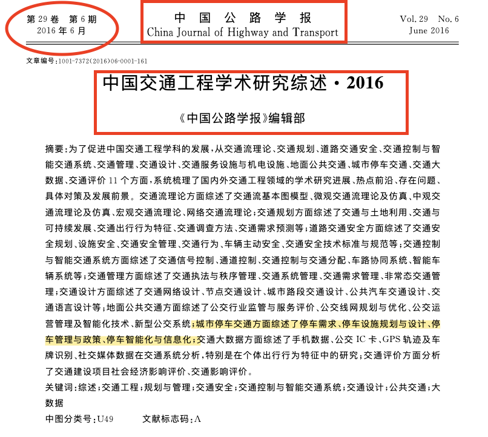

- step 1：开头四看，期刊、题目、发表时间、作者，判断是不是本领域知名期刊，题目与我的研究内容的相关性，是不是大佬？

- step 2：详读摘要和关键词，并对重点关注之处进行高亮标记，读过留痕。
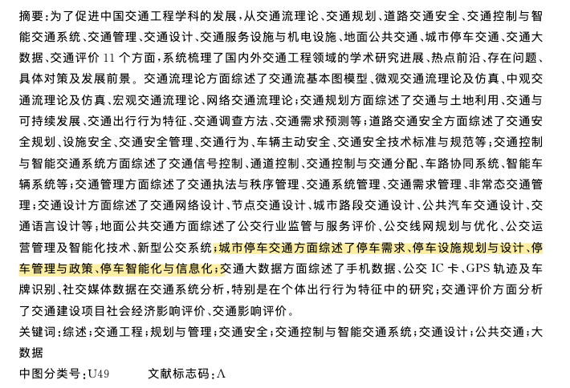

- step 3：细看引言，对新手建立概念很有帮助。引言中会介绍本研究的较大范围的研究背景和研究基础，比如，全球某领域的发展情况，引出待研究问题（一般都是自卖自夸，强调这个问题非常重要，亟待解决）。同时，在引言中会介绍相对基础的专业知识，非常符合科研新手需求，比如，本篇文献中给出了交通工程包含的研究范围，包括交通流理论、交通规划、交通安全、交通控制与智能交通系统、交通管理、交通设计、交通服务设施与机电设施、地面公共交通、城市停车、交通大数据以及交通评价等，并随着时代的前进而发生变迁。
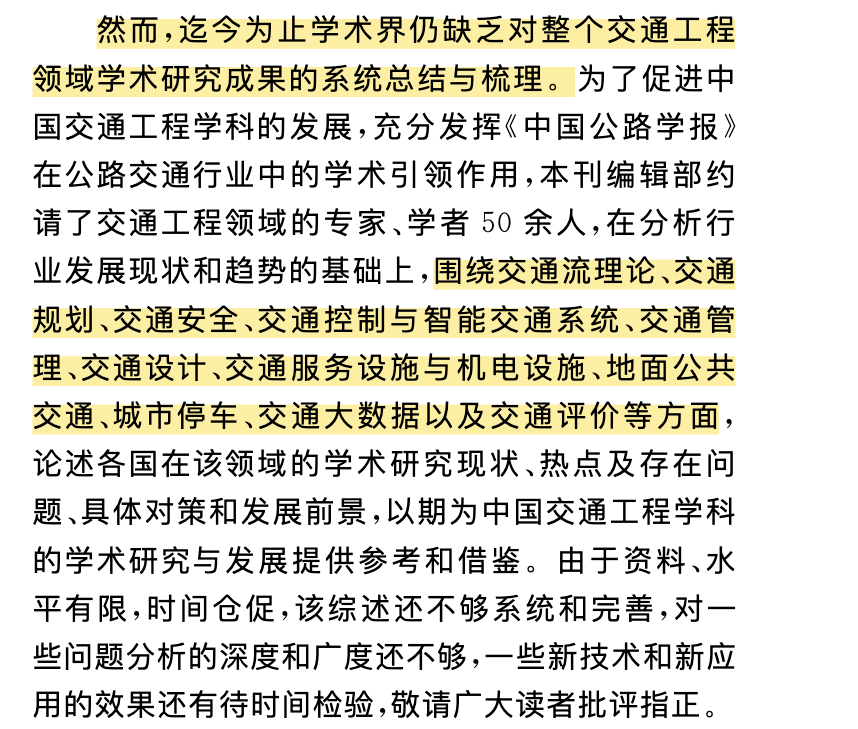

- step 4：看各部分的大标题和图。大概了解这篇文章在讲啥，包括哪几个方面。比如，这篇论文包含11个方面，涵盖了目前交通工程研究的全部范畴。
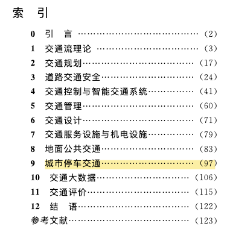

- step 5：看结论。通过结论可以了解到本文的研究到底在解决哪些问题，是怎么解决的，运用了什么方法和技术。比如，这篇论文指出，交通工程的目的就是如何提升交通系统的运行效率和服务水平，所以本文从上述11个方面进行了综述。
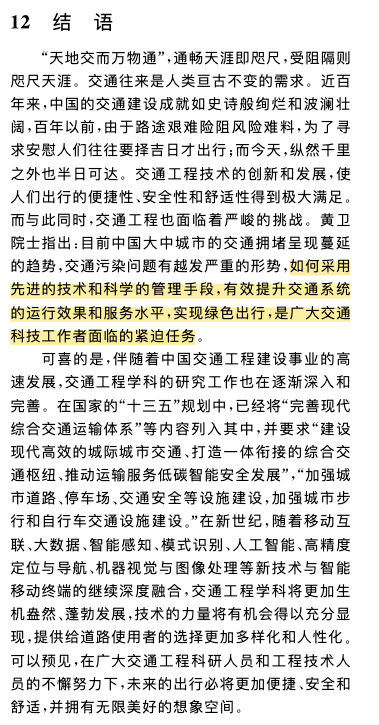

- step 6：粗读参考文献部分，这个习惯也非常重要。参考文献部分已经帮大家整理好了相似文献，非常节省找文献时间。到此，已经在五分钟内读完了一篇文献。可以初步判断，这篇论文的价值以及与自己研究方向的契合度，能够回答 Why 和 What 的问题。若想进一步深入了解，这些方法到底是什么、具体怎么操作，则需要开启第二轮阅读，回答 How 的问题。

### 1.2 中文硕/博士论文怎么看？
对科研新手来说，看硕博士论文是建立系统认知最快的方式，这些论文中详细介绍了本领域研究进展且覆盖面相对较大，非常有利于快速上手。以中国知网检索博士论文为例，搜索关键词“早高峰通勤”。

以博士论文《考虑可变通行能力及停车位约束的早高峰通勤问题研究》为例进行说明。

- step 1：致谢和个人简历。满足个人好奇心的同时，可以熟悉国内学术圈的学缘关系。若是自己师兄师姐的论文，那么通过致谢能够大致了解到课题组人员构成、个人性格特点等信息。
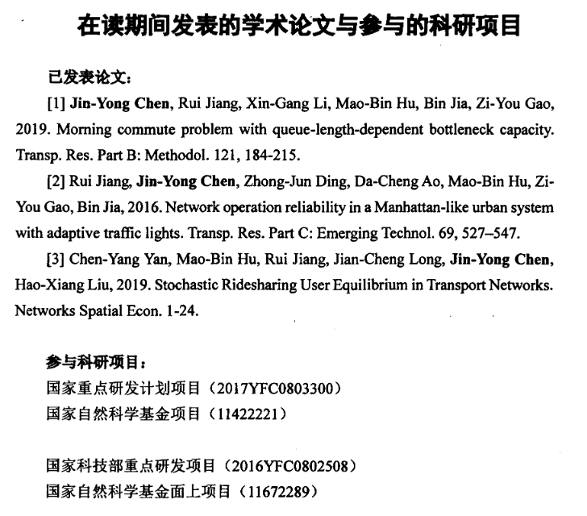
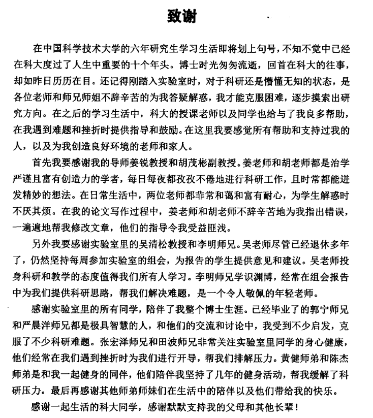

- step 2：详读摘要和关键词，并对重点关注之处进行高亮标记，读过留痕。
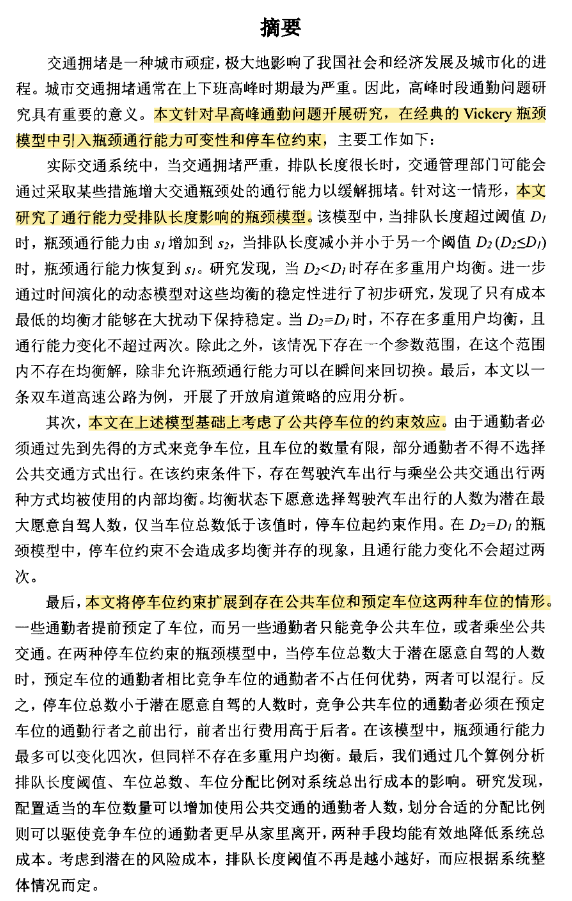
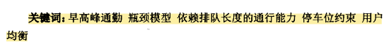

- step 3：详读目录，了解大论文整体框架和内容。绪论部分针对列出的几个研究内容进行详细的综述，包括工程问题、研究进展、研究方法、主要结论等。相比正文内容，该部分内容相对基础和宏观，非常适合上手。
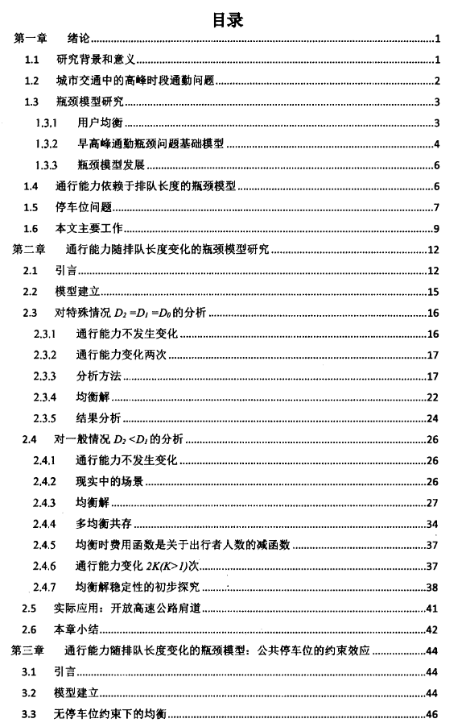
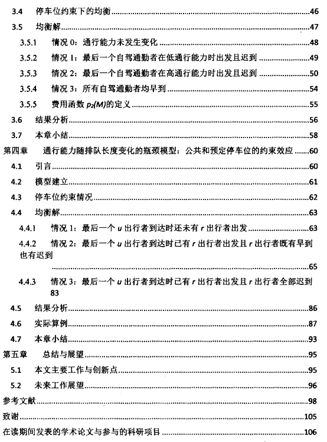

- step 4：看每章的引言。该部分会写明更细节、更深入的研究背景，并交代本章节的研究内容、研究思路、研究方法和结论。

- step 5：对于每一章，看大标题和图片，以及主要结论。

通过上述五个步骤，应该可以回答 Why 和 What 的问题了。建立整体框架思维，此阶段不必纠结于细节，先把框架搭起来。

#### 1.3 英文期刊论文怎么看？
在阅读了一些中文期刊后，对专业术语有了一定的积累，就可以开始阅读英文期刊论文了。毕竟英文期刊才是绝对的主流。主要步骤同 1.1 中中文期刊论文的相同。找方向阶段也不需要看的很细，但对于本领域的经典论文或导师让看的论文需要仔细看，搞清楚 Why、What 和 How。但对于难度系数很大的理论、公式可不必搞明白，只需要明白它的作用、大致原理即可。中英文不同之处主要有：

1）英文论文一般都很长，讲的相对中文论文更细致一些，体量大概是中文论文的 2-3 倍；

2）对英文阅读基础虽有一定的要求，但是关系不大。

### 2. 在现有研究基础上，寻找创新点
应该以本领域 top 英文期刊为主，这些期刊展示了本领域最新最权威研究成果（可以蹭热点），跟随大佬的研究步伐，比较好发文章。在读文献过程中，重点就转移到 Ideas 之问上——文献有哪些不足？我可以在哪些方面进行创新？先按照上部分中介绍的方法，看摘要、图、结论，判断与自己研究方向的契合度和启发意义。若相关性很高，则立马打起十二分精神。

必须展开仔细研读，Introduction 不需要花费太大精力，聚焦的重点在文章的主体部分——对理论的阐述、模型的介绍等，如下图中的xxx，对模型构建进行了详细描述，公式和参数意义均需掌握。只有读的细致了，才能发现其中的问题。比如，论文模型中某个公式的简化存在较多理想性假设，那么可以在此基础上，考虑更实际更复杂情况下，提出某个参数对公式进行修正，并利用修正后的公式对模型进行重新计算，对比修正前后的差异，这足以支撑起一篇具有明显创新点的 SCI 论文了。

此外，对于论文的参考文献也需要仔细查看、阅读，并利用一切机会寻找新的创新点，一个创新点就足以支撑起一篇 SCI。

### 3. 研究中遇到某个问题，寻找解决问题的方法
全部招数都用上，力求找到类似问题的处理方法，并用最短的时间解决问题。通过论文寻找理论依据和实验解决方案；通过 Github 寻找已经构建的代码，大大减少自己敲代码和 debug 的时间；通过 Youtube、知乎、B站找一些软件教程等内容。

### 4. 论文写作过程中 Introduction 需要素材支撑
通过在中国知网、Web of Science等输入检索关键词，找到类似的文章下载十几篇，看 Abstract、Introduction 和 Conclusion 即可，写作句式可参考：Andersen et al. (2021) studied effects of soil uncertainty on the first natural frequency of the structure in clay using a beam on nonlinear Winkler foundation model. 在审稿时这部分内容基本上是一略而过，毕竟都是别人的东西。

然而，top 期刊和大佬的论文一定要多引用，这会让审稿人觉得你很专业，你的论文是站在顶级期刊和行业大佬的肩膀上的新成果。参考文献数量一般需要在 30 篇以上。

## 参考资料
- [科研大牛们怎么读文献？](https://gong.ustc.edu.cn/2022/1128/c21214a582641/page.htm)
